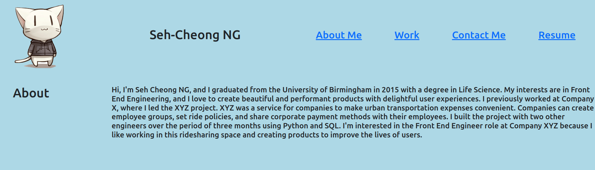

# My-Portfolio-with-bootstrap
This is the portfolio page (built using Bootstrap) of me Seh-Cheong NG, a Junior front-end developer with a lot of passion in buidling great and beautiful website!

The website shows how Bootstrap can help to set up the layout of the page and organise things nicely!

In the page, you will be able to navigate to different part of the page with the navigation bar.

On the first section you will know a little bit about my background. Then you will have a list of of my works organised in a carousel, try clicking next/previous for navigation and click the image to get to Github page.

If you find my profile and work interesting, welcome to contact me via multiple different channels by simply clicking on the channel icon.

And lastly I include a list of my previous work experience in the Resume section.

Do try resizing the page and you will see how the media queries can change the look of the page.

Thanks!